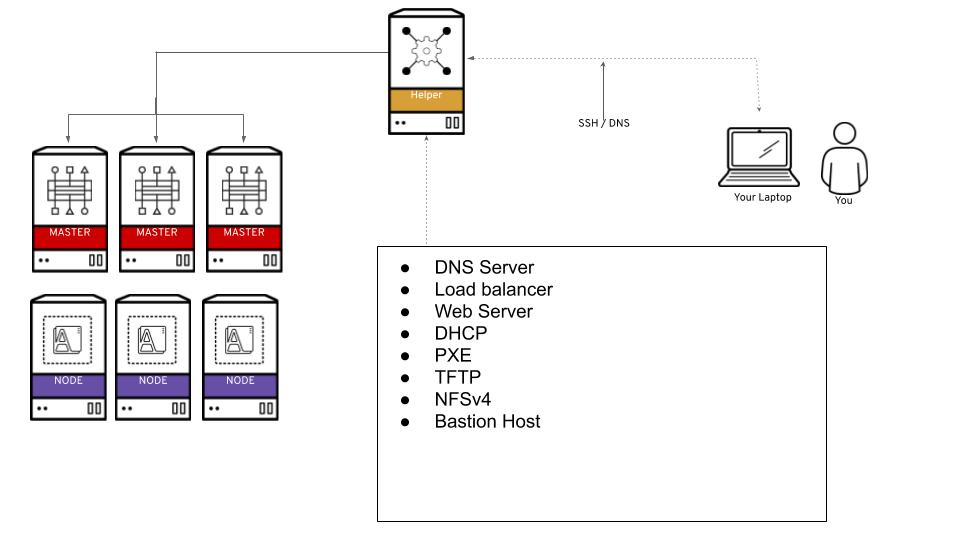

OCP4-UPI-HELPERNODE
=========

This role deploys something we call **helpernode**, which acts as a multi-purpose/multi-service node that is helpful when you are installing Red Hat OpenShift v4.X.

The roles performs the following actions:

* Sets timezone to UTC
* Installs pre-requisites
* Sets zone serial number
* Writes out DNS domain zone file
* Writes out reverse zone file
* Writes out haproxy config file
* Configures Apache
* Configures Chronyd
* Opens up firewall ports
* Configures NFS
* Creates TFTP and configures it
* Generates PxE config files
* Starts certain services
* Configures OpenShift PVCs
* Builds & installs filetranspiler
* Sets up DNS server IP and search path on the network interface
* Provides information about the installation

> You can visit the [quickstart](docs/quickstart.md) to get right on it and start

This assumes the following:

1. You're on a Network that has access to the internet
2. The network you're on does NOT have DHCP
3. The helpernode will be your LB/DHCP/PXE/DNS and HTTPD server
4. You still have to do the OpenShift Install steps by hand (this just sets up the node to help you)
5. I used CentOS 7
6. You will be running the `openshift-install` command from this helpernode



It's important to note that you can delegate DNS to this helpernode if you don't want to use it as your main DNS server. You will have to delegate `$CLUSTERID.$DOMAIN` to this helper node.

For example; if you want a `$CLUSTERID` of **ocp4**, and a `$DOMAIN` of **example.com**. Then you will delegate `ocp4.example.com` to this helpernode.

Requirements
------------

> **NOTE** If using RHEL 7, you will need to enable the `rhel-7-server-rpms` and the `rhel-7-server-extras-rpms` repos. [EPEL](https://fedoraproject.org/wiki/EPEL) is also recommended for RHEL 7.

Install a CentOS 7 server with this recommended setup:

* 4 vCPUs
* 4 GB of RAM
* 30GB HD
* Static IP

Then prepare for the install

```bash
yum -y install ansible git
git clone https://github.com/waynedovey/ocp4-upi-helpernode
cd ocp4-upi-helpernode
```

Role Variables
--------------

Variables that are in `defaults/main.yml`:

* `staticips`
* `force_ocp_download`
* `ocp_bios`
* `ocp_initramfs`
* `ocp_install_kernel`
* `ocp_client`
* `ocp_installer`

Inside the examples dir there is a [vars.yaml](docs/examples/vars.yaml) file ... **__modify it__** to match your network (the example one assumes a `/24`)

> **NOTE** See the `vars.yaml` [documentaion page](docs/vars-doc.md) for more info about what it does.

Run the playbook
----------------

Once you edited your `vars-helpernode.yaml` file; run the playbook - e.g.:

```bash
ansible-playbook -e @vars-helpernode.yaml playbook.yml
```

Helper Script
-------------

You can run this script and it's options to display helpful information about the install.

```bash
/usr/local/bin/helpernodecheck
```

Install OpenShift 4 UPI
-----------------------

Now you're ready to follow the [OCP4 UPI install doc](https://docs.openshift.com/container-platform/4.2/installing/installing_bare_metal/installing-bare-metal.html#ssh-agent-using_installing-bare-metal)

Dependencies
------------

Nothing at the moment.

_A list of other roles hosted on Galaxy should go here, plus any details in regards to parameters that may need to be set for other roles, or variables that are used from other roles._

Example Playbook
----------------

An example of how to use the role:

```yaml
- hosts: localhost
  roles:
      - { role: ocp4-upi-helpernode, key: value }
```

License
-------

MIT

Author Information
------------------

Red Hat, Inc.
